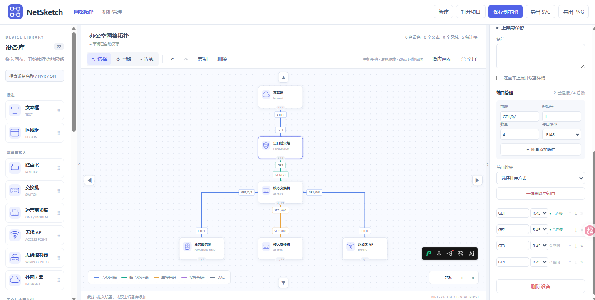
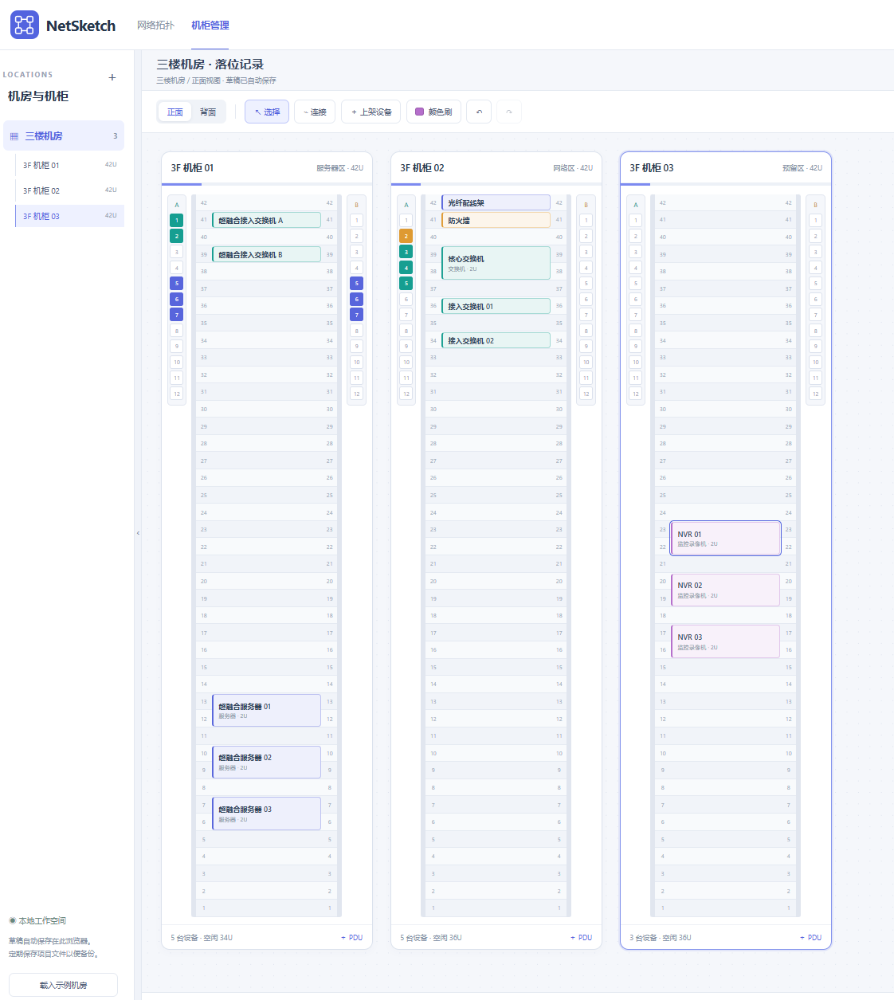

# NetSketch 网络拓扑工作台

## 功能演示

### 网络拓扑

自由摆放设备、记录端口与线路信息，支持本地保存和图片导出。

### 机柜管理

记录设备 U 位、PDU 插座占用和电源关联；支持跨机柜 PDU 级联，自动检查循环和插座重复占用。

## 使用说明

新增独立的「机柜管理」页面：在右上角切换，或打开 http://localhost:4173/racks.html 。支持机房与机柜、U 位落位、前后视图、拖动上架位置、PDU 插座及设备多路电源关联、独立本地项目保存、CSV 表格导出和打印。详细操作见 [机柜管理说明](机柜管理说明.md)。

重启后的启动步骤与常见问题请查看 [启动说明](启动说明.md)。

无需安装第三方依赖。安装 Node.js 后，在此目录执行 `npm start`，浏览器打开 http://localhost:4173 。也可直接双击 index.html 使用，建议固定使用本地服务地址以保持草稿存储位置一致。

- 从设备库拖入设备，或双击设备库条目添加。
- 设备库包含 20 类设备，按网络与接入、安全与应用交付、计算存储与监控、机房基础设施分组；可按中文名称或 NVR / ONT / NAS 等英文关键词搜索。
- 提供上网行为管理、运营商光猫、无线控制器、VPN 网关、负载均衡、监控录像机、网络摄像机、NAS、配线架、光纤收发器、UPS、打印机和通用设备；默认端口仅为初始模板，可按实际型号修改。UPS 默认提供网络管理口，光猫提供 PON 和 LAN 口。
- 选择设备，在右侧编辑品牌、型号和完整端口列表；支持批量添加及空闲端口删除。
- 设备属性包括设备用途、管理 IP 地址、设备类型、品牌、型号、序列号、管理协议、管理服务端口、物理位置、设备归属、供应商、上架时间、保修信息、保修期至、备注。保修信息和备注支持多行输入；管理连接、位置归属和保修区块可折叠。管理服务端口和用于连线的物理端口独立维护。
- 新字段随本地项目和浏览器草稿一起保存，打开旧版项目时自动补为空值；画布仍默认保持简洁。
- 已填写的管理 IP 常驻显示在设备卡片上，较长地址自动换行；PNG/SVG 导出同步显示。未填写时不占空间。
- 单行管理 IP 使用设备卡片下方原有空间，卡片保持 160×80 像素；较长地址换行时才增加高度。
- 管理 IP 支持多行输入，按 Enter 换行；设备卡片与 PNG/SVG 导出保留手动换行，多行时自动增加卡片高度。
- 左侧“标注”提供文本框，可拖入或双击添加，在右侧编辑多行内容；支持网格拖动、撤销、项目保存和 PNG/SVG 导出。
- 点击“连线”，依次选择两台设备及空闲端口。端口不可重复占用。
- 创建或选中线路时可填写带宽，提供 100 Mbps、1 Gbps、10 Gbps 等建议值，也支持自定义及留空。带宽随项目保存，更换两端端口时保留，旧项目默认未填写；默认在属性面板查看。
- 勾选“在主图显示带宽”后，在线路中段附近显示带宽标签，自动避让设备和端口标签；取消勾选可隐藏。未填写带宽时不显示标签。该选项随项目保存并应用于 PNG/SVG 导出。
- 线路颜色区分线材类型，两端端口号保持显示。选中线路可以改线材、颜色或两端端口。
- 双击设备名称直接修改，回车或失焦保存、Esc 取消；双击设备其他位置展开详情；Shift 点击多选，空白拖动框选；空格拖动或中键平移，滚轮缩放。
- 拖动或添加设备时吸附到 20 像素网格，不进行设备间吸附。设备宽 160 像素，默认高 80 像素；管理 IP 和详情展开后的高度自动取网格整数倍。
- Ctrl+Z 撤销，Ctrl+Shift+Z / Ctrl+Y 重做，Delete 删除，Ctrl+S 保存项目。
- 项目保存为 `.netsketch.json`，可重新打开；PNG/SVG 用于分享。浏览器自动保存最近草稿，不替代项目文件备份。
- 新建、载入示例和打开项目都可以撤销。删除设备会同时删除它的连接，支持撤销。

数据不发送到服务器，不需要登录。品牌型号为手动填写，接口类型为记录属性，不限制不同接口之间的连接。连线自动选择上下左右接入方向，优先直线或较少折角，并尝试绕过设备；设备重叠或间隙过窄时可移动设备调整线路。目前不提供手动拐点。当前主要面向桌面浏览器。

- 左侧“标注”包含文本框和区域框。区域框可选择背景颜色，位于设备与连线下方。选中后拖动四角调整大小，或在右侧输入宽高；尺寸吸附到 20px 网格，随项目保存并保留在 PNG/SVG 导出中。
- 选中设备后点击“复制”复制属性和端口配置，支持多选，也支持文本框与区域框；副本错开一格，不复制原线路。
- 端口支持名称自然升降序、接口类型、已连接优先排序，以及逐行上移/下移。删除端口保留列表滚动位置；一键删除空闲口保留已连接端口，支持撤销。

- 设备名称下方优先显示型号，型号未填写时显示设备类型，PNG/SVG 导出同步显示。

- 双击画布空白处切换回选择工具。

- 点击工具栏“平移”后，可只用鼠标左键拖动画布；点击“选择”或双击空白处返回选择。设备库、属性栏靠近画布的边缘竖条可分别收起或展开。
- 两侧展开／收起竖条固定在栏的边缘，滚动内容时仍可使用。画布四边提供方向按钮，点击移动一步，按住可连续移动视图。
- “适应画布”旁的“全屏”按钮仅保留画布和操作工具栏，再次点击或按 Esc 退出；退出后恢复原侧栏展开状态。浏览器不支持系统全屏时使用页面内全屏布局。
- 区域框可设置文字大小（8–72px）与文字颜色，设置随项目保存并同步用于 PNG/SVG 导出。
- 拖动设备时按屏幕刷新帧率合并更新，只预览移动设备及相关线路；松开后再计算完整避让与标签布局。
- 全屏默认收起两侧栏，但保留边缘竖条，可随时展开设备库或属性栏；退出全屏恢复进入前的侧栏状态。

机柜管理支持同 U 左右半宽设备、前后独立占用、双侧 U 位标尺、随设备颜色显示的 PDU 插座、PNG/SVG 完整机柜图片导出；Del 下架可撤销。两个页面采用统一顶部导航和文件操作区。
